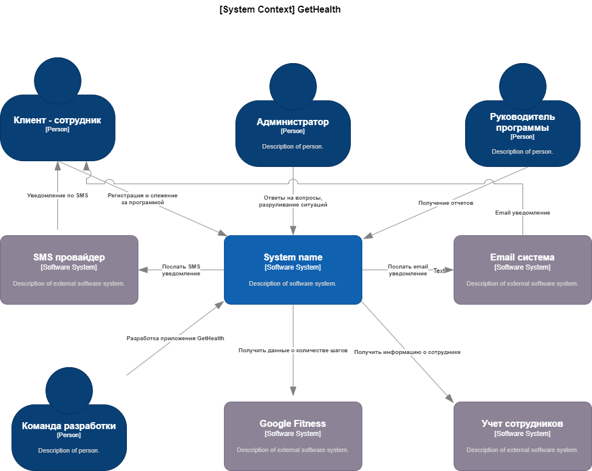

# Выбор подхода к созданию сервиса GetHealth
## Контекст

- Очень крупная компания (> 100000 человек) желает приучить к здоровому образу жизни своих сотрудников. Для этого она хочет создать сайт и мобильное приложение, в котором каждый зарегистрированный сотрудник может выбрать подходящую для своего возраста программу здоровья, рассчитанную на 12 недель. В этой программе есть контроль за состоянием здоровья через фитнес-браслеты и учет количества шагов за день. Если в течение 12 недель сотрудник каждый день проходит больше количества шагов для указанного возраста, то в конце программы здоровья ему начисляется бонус-премия в размере 20 % от оклада;
- нет предистории разработки такого сервиса, нет команды, нет наработок;
- получение данных о количестве шагов из Google Fitness
- необходимо выбрать способ разработки сервиса GetHealth из нескольких вариантов с учетом критических характеристик:
 - доступность сервисов программы здоровья;
 - процент нормальных ответов 99.9
 - время ответа сервиса и базы данных (95% квантиль не больше 3 сек.)
 - надежность - не должно быть потерянных шагов
 - безопасность - информация не должна выходить за пределы контура компании
 - расширяемость - возможность подключения других программ здоровья
 - минимальное время разработки
 - минимальная стоимость разработки
- использовать ли NoCode, LowCode или создавать полнофункциональный сервис с нуля;

# Схема
<!---->

## Варианты подходов
# 1. Использование NoCode платформы
Вариант использования NoCode платформы для программирования основного функционала сервиса с добавлением отдельного кода для доступа к количеству шагов из Google Fitness

Оценка по критическим характеристикам:
- Надежность - ?? - не очень высокая, нет уверенности в том, что NoCode платформа будет надежно работать, нет опыта
- Безопасность - ??? - невысокая, надо проверять 
- Расширяемость - ??? - невысокая, т.к. зависит от плагинов и нет уверенности, что необходимый плагин реализован
- Время разработки - TT - довольно небольшое, т.к. необходимо обучить разработчиков новому инструменту и есть вероятность необходимости реализации недостающего плагина
- Стоимость разработки - $ - небольшая, т.к. нет необходимости в программировании и оплаты за квалификацию разработчиков 

# 2. Полнофункциональная разработка вэб-сервиса
Вариант использования команды квалифицированных программистов для программирования основного функционала сервиса, для интеграции с Google Fitness и удаленной платформой аутентификации и авторизации

Оценка по критическим характеристикам:
- Надежность - ? - высокая, с учетом квалификации разработчиков и архитектора
- Безопасность - ? - высокая, т.к. используются проверенные механизмы и библиотеки для обеспечения безопасности 
- Расширяемость - ? - высокая, т.к. процесс разработки и наличие функционала полностью в руках разработчиков
- Время разработки - TTT - довольно большое, т.к. необходимо найти разработчиков в команду и добавить время разработки и тестирования
- Стоимость разработки - $$$ - большая, т.к. необходимо учитывать оплату труда разработчиков на время создания сервис и стоимость железа

# Решение:
- Выбран вариант 2
 
# Последствия решения:

- мы полностью контролируем процесс разработки 
- можем выбирать наиболее подходящий стек разработки и необходимые фреймворки

# Риски:
- недостаточная квалификация разработчиков и архитектора
- недостаток времени
- недостаток финансирования

