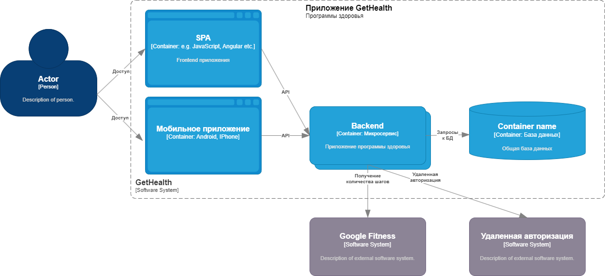
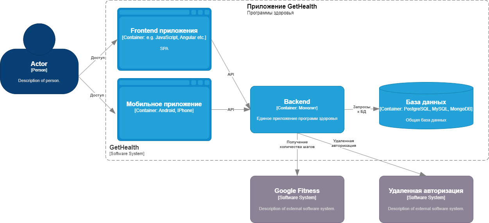

# Выбор структуры сервиса GetHealth
## Контекст

- Очень крупная компания (> 100000 человек) желает приучить к здоровому образу жизни своих сотрудников. Для этого она хочет создать сайт и мобильное приложение, в котором каждый зарегистрированный сотрудник может выбрать подходящую для своего возраста программу здоровья, рассчитанную на 12 недель. В этой программе есть контроль за состоянием здоровья через фитнес-браслеты и учет количества шагов за день. Если в течение 12 недель сотрудник каждый день проходит больше количества шагов для указанного возраста, то в конце программы здоровья ему начисляется бонус-премия в размере 20 % от оклада;
- нет предистории разработки такого сервиса, нет команды, нет наработок;
- необходимо выбрать способ разработки сервиса GetHealth из нескольких вариантов с учетом критических характеристик:
 - доступность сервисов программы здоровья;
  - процент нормальных ответов 99.9
  - время ответа сервиса и базы данных (95% квантиль не больше 3 сек.)
  - надежность - не должно быть потерянных шагов
  - безопасность - информация не должна выходить за пределы контура компании
  - расширяемость - возможность подключения других программ здоровья
  - минимальное время разработки
  - минимальная стоимость разработки
- По ADR1 выбрано решение сделать полнофункциональный веб и мобильный сервис с помощью команды пазработчиков;
- Необходимо выбрать структуру приложения

## Варианты структур сервиса

# 1. SPA + backend из микросервисов
<!--! [Схема SPA+ backend из микросервисов](https://drive.google.com/file/d/1Zpvxtvm-3rxlneZeTXMFNW0gwnMRPGnw/view?usp=drive_link)-->

<!--">-->

Для каждого нового функционала можно реализовывать отдельный микросервис с одной базой данных

Оценка по критическим характеристикам:
- Надежность - ++ - достаточно высокая
- Безопасность - ++ - достаточно высокая 
- Расширяемость - ++ - высокая, мы можем добавлять функционал с помощбю новых микросервисов
- Время разработки - TT - довольно большое, т.к. необходимо организовать совместную работу микросервисов и разработку в команде
- Стоимость разработки - $$ - довольно большая, т.к. необходимо распределят работу по микросервисам

# 2. SPA + backend монолит
<!--! [Схема SPA+ backend монолит](https://drive.google.com/file/d/1w5GHJkxO-hkcGFf5Oi0OtgMJCxB4RZe0/view?usp=share_link)-->

Оценка по критическим характеристикам:
- Надежность - +++ - в начале разработки высокая, но по мере добавления новых фичей может снижаться
- Безопасность - ++ - достаточно высокая 
- Расширяемость - + - невысокая, т.к. может появиться необходимость изменять общую структуру всего приложения
- Время разработки - T - небольшое, т.к. нет необходимоси организовывать работу микросервисов
- Стоимость разработки - $ - небольшая, т.к. нет необходимости распределять работу между микросервисами

# Решение:
- Выбран вариант 1
 
# Последствия решения:

- легко добавлять новый функционал
- для разных микросервисов можем выбирать различные команды и стек разработки 

# Риски:
- недостаточная квалификация разработчиков и архитектора для реализации взаимодействия микросервисов
- недостаток времени
- недостаток финансирования
