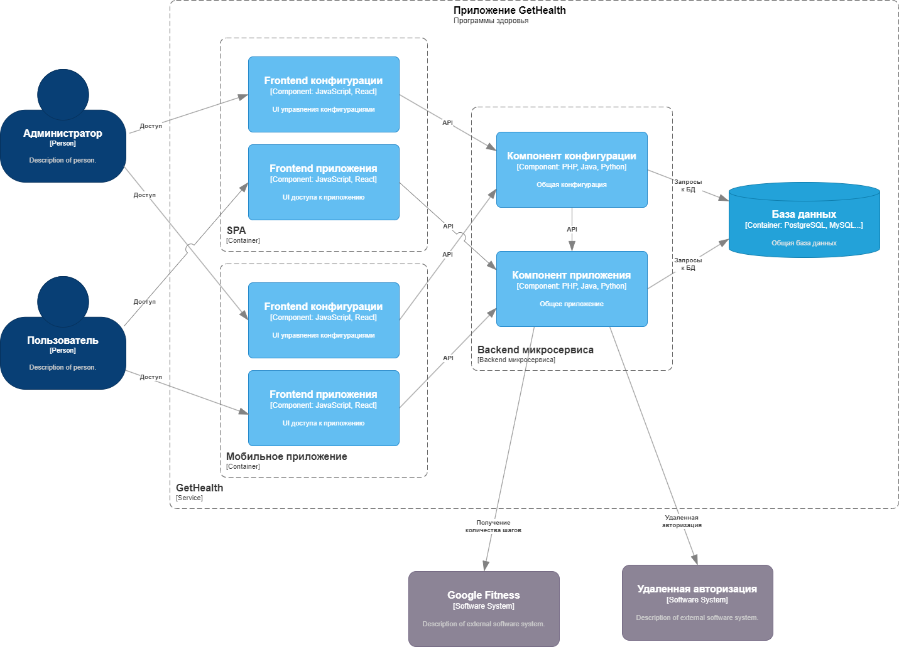
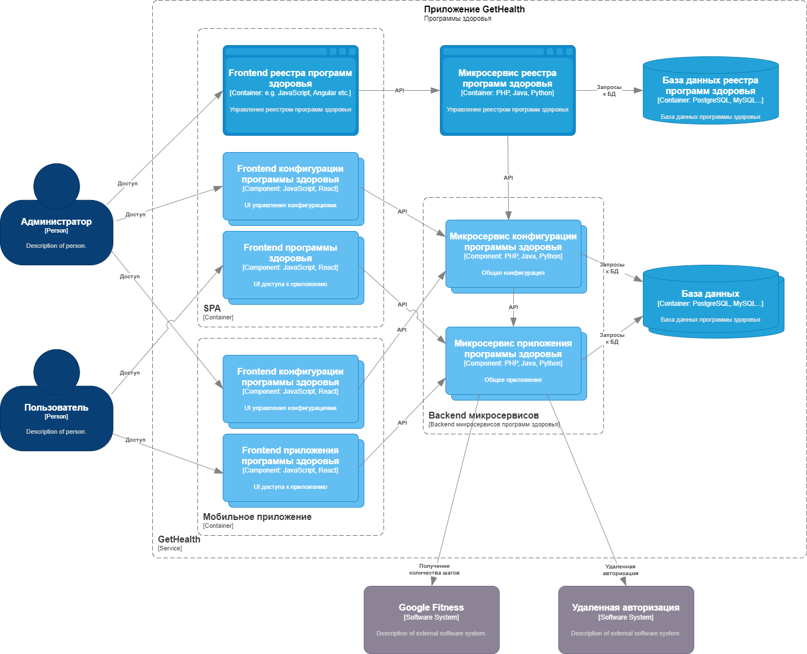

# ADR3 - Изменение схемы сервиса GetHealth по дополнительным требованиям
## Контекст

- Очень крупная компания (> 100000 человек) желает приучить к здоровому образу жизни своих сотрудников. Для этого она хочет создать сайт и мобильное приложение, в котором каждый зарегистрированный сотрудник может выбрать подходящую для своего возраста программу здоровья, рассчитанную на 12 недель. В этой программе есть контроль за состоянием здоровья через фитнес-браслеты и учет количества шагов за день. Если в течение 12 недель сотрудник каждый день проходит больше количества шагов для указанного возраста, то в конце программы здоровья ему начисляется бонус-премия в размере 20 % от оклада;
- нет предистории разработки такого сервиса, нет команды, нет наработок;
- необходимо выбрать способ разработки сервиса GetHealth из нескольких вариантов с учетом критических характеристик:
 - доступность сервисов программы здоровья;
  - процент нормальных ответов 99.9
  - время ответа сервиса и базы данных (95% квантиль не больше 3 сек.)
  - надежность - не должно быть потерянных шагов
  - безопасность - информация не должна выходить за пределы контура компании
  - расширяемость - возможность подключения других программ здоровья
  - минимальное время разработки
  - минимальная стоимость разработки
- По ADR2 выбрано решение  - SPA + backend из микросервисов;
- Необходимо доработать архитектуру микросервисов с учетом дополнительных требований - создание конфигурационного интерфейса для удаленного управления программами здоровья:
 * Запуск программы здоровья (с возможностью публикации на сайте приветственного слова).
 * Изменение количества шагов в день.
 * Изменение продолжительности программы.
 * Возможность подключения новых программ здоровья.

## Варианты решений

# 1. Внедрение фнкуционала в SPA  с доработкой backendа из микросервисов

Новый функционал внедряется в SPA и микросервисы backend с одной базой данных. По сути - это монолит в микросервисах.

Оценка по критическим характеристикам:
- Надежность - ++ - достаточно высокая
- Безопасность - ++ - достаточно высокая 
- Расширяемость - + - невысокая, нам будет трудно добавлять новый функционал
- Время разработки - TT - довольно большое, т.к. необходимо организовать совместную работу микросервисов и разработку в команде.
- Стоимость разработки - $$$ -  большая, т.к. необходимо каждый раз менять структуру программы.

# 2. SPA (из микросервисов frontendа)+ backend (микросервисы новых программ здоровья)
<!--! [Схема SPA+ backend монолит](https://drive.google.com/file/d/1w5GHJkxO-hkcGFf5Oi0OtgMJCxB4RZe0/view?usp=share_link)-->

Необходимые изменения:
- Новые программы здоровья реализуются отдельными микросервисами (frontend + backend) со своей схемой в БД (как вариант - со своей БД).
- Для каждой новой программы здоровья реализуются дополнительные конфигурационные микросервисы (frontend + backend), которые позволяют изменять текущую конфигурацию программы здоровья в БД. (Как вариант - добавляются возможности конфигурирования в существующие микросервисы с доступом по ролевой модели).  
- Для всех новых микросервисов программ здоровья реализуется дополнительный запрос в АПИ, который инициирует перечитать конфигурацию из БД и перезапусить микросервис (как вариант - в запросе посылать новую конфигурацию и перезапускать после завершения квантованного действия)
- Существующий backend микросервис "Шаги за бонусы" доработать с учетом новых требований. 
- Разработать общий конфигурационный сервис (frontend+backend) для считывания реестра микросервисов новых программ здоровья из БД и управления ими (вкл/выкл) 

Оценка по критическим характеристикам:
- Надежность - ++ - сложность оркестрации всех микросервисов
- Безопасность - ++ - достаточно высокая 
- Расширяемость - +++ - высокая
- Время разработки - TT - не очень большое, т.к. разработан единый подход.
- Стоимость разработки - $$ - не очень большая, пропорциональна времени написания новых микросервисов.

# Решение:
- Выбран вариант 2
 
# Последствия решения:

- легко добавлять новый функционал разработкой новых микросервисов с единым подходом
- необходимо описать общую часть АПИ
- разделение конфигурации и рабочей части
- для разных микросервисов можем выбирать различные команды и стек разработки 

# Риски:
- недостаточная проработка общей части АПИ.
- сложность развертывания.