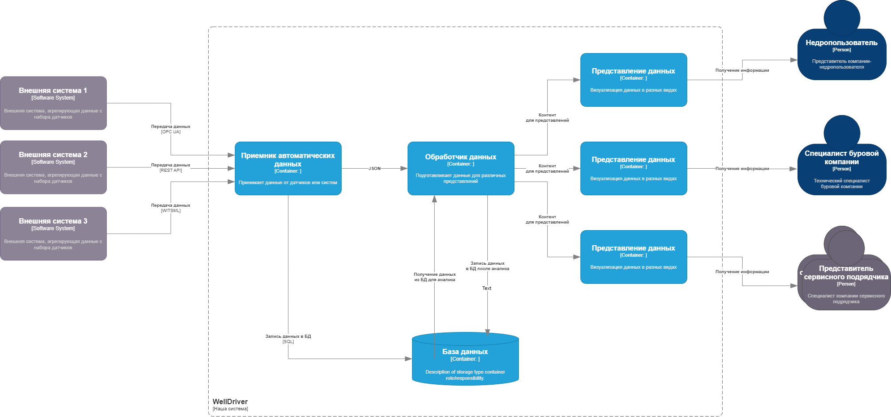

# WellDriver
В этот раз тема приближена к моей предметной области.

В последнее время в сфере нефтесервиса наметилась тенденция к цифровой трансформации процесса бурения нефтяных и газовых скважин. Такие понятия как "цифровой двойник буровой установки" или "интеллектуальное бурение" уже вошди в обиход как недропользователей, так и буровых компаний и сервисных подрядчиков. Основная цель - повысить эффективность строительства нефтегазовых скважин и обеспечить полную безопасность работ.  Надо сказать, что процесс строительства скважин имеет сложную структуру взаимодействия множества сервисных подрядчиков, каждый из которых преследует собственные бизнес-цели и имеет собственные средства и инструменты. Также процесс строительства скважин имеет собственную специфику, обусловленную удаленностью объектов, сложностью организации связи, постоянными перемещениями и непростыми природными условиями. 
В связи с этим была поставлена цель разработать инструмент, который бы собирал всю необходимую информацию с буровых установок, проводил комплексный анализ и обеспечивал автоматизированный процесс бурения. 

## Бизнес-цель

Разработать систему автоматизации процесса строительства нефтегазовых скважин для повышения эффективности бурения и обеспечения безопасности работ.

## Бизнес-драйверы

* Наша страна заинтересована в интенсификации нефтегазовой отрасли, как основного драйвера развития экономики. 
* Недропользователи заинтересованы в объективном контроле за работой буровых компаний и сервисных подрядчиков. 
* Буровые компании и сервисные подрядчики заинтеесованы в автоматизации процесса для снижения затрат и времени бурения, повышении качества и безопасности.
* Работники заинтересованы в атоматизации для улучшения условий труда, повышении зарплаты и безопасности.

## Требования

* Система WellDriver устанавливается на локальных объектах и имеет собственное хранилище. 
* Система собирает данные от всех источников.
* Необходимость сбора всех данных без потери.
* Система осуществляет предварительную обработку различных видов данных и анализ в интересах стейкхолдеров.
* Система производит визуализацию информации для мониторинга процесса бурения для заинтересованных лиц. 

## Дополнительный контекст

* Регистрация в программе только сотрудников компании по ролевой модели.
* Планируется расширение количества источников данных и сигналов.
* Планируется добавление аналитических задач.
* Планируется увеличение задач по мониторингу и алертингу при превышении заявленных параметров.

## Стайкхолдеры

* Стейкхолдеры по иерархии подряда в нефтесервисе - недропользователи (держатели месторождений) -> буровые компании (имеют буровые установки и могут бурить) -> сервисные подрядчики (нанимаются буровыми  компаниям по различным видам работ - буровые растворы, долота, наклонно-направленное бурение, автоматизация бурения и т.п.)
* Недропользователи в лице руководителей направлений заинтересованы в скорейшем освоении месторождений.
* Буровые компании и сервисные подрядчики в лице руководителей и специалистов заинтересованы в снижении затрат, качестве работ и безопасности.
* Работники и специалисты по своим направлениям заинтересованы в повышении качества работ, скорости проходки, безопасности и в конечном счете в увеличении зарплаты.  
* Команда разработки - заинтересована в разработке качественного конкурентоспособного продукта.

## Пользовательские истории

* Клиенты на локальном объекте регистрируются в системе и получают информацию по их направлению соответственно ролевой модели.
* Руководители и специалисты-кураторы подключаются удаленно и получают соответствующую их роли информацию в реальном времени.
* Система автоматически получает данные со всех источников информации на буровой площадке.
* Система прводит в реальном времени предварительный анализ полученной информации для валидации данных.
* Система вычисляет значения параметров, которые должны быть выведены из анализа полученной в реальном времени информации. 
* Система получает информацию, вводимую вручную через формы ввода или оцифровкой файлов.
* Система проводит периодический анализ на исторических данных для составления отчетов.

## Атрибуты качества или свойства архитектурв

* Доступность - Сервис системы должен быть доступен с любое время (99,9 - исходя из специфики работы).
* Производительность - Время отклика < 1 секунды.
* Сохранность - Не должно быть потери информации.
* Безопасность - Полученная и обработанная информация должна храниться в безопасности.
* Расширяемость - Должна быть возможность подключения других алгоритмов расчета, любых новых источников данных и т.п.
* Масштабируемость - Должна быть предусмотрена возможность значительного увеличения источников данных и параметров (x100).
* Модифицируемость - возможность добавления новых функций и безшовного изменения старых.

## Критические сценарии и критические характеристики

* доступность сервисов системы , здесь подразумевается не только доступность через пользовательский интерфейс, но и доступность в смысле получения информации со всех данных;
* процент ошибочных ответов от сервиса - ориентироваться на 99.9%
* время ответа сервиса (95% квантиль времени ответа сервисов для клиента не должно превышать 1с);
* надежность: не должно быть потерянной информации;
* информационная безопасность – должны регистрироваться только сотрудники компаний, имеющих санкцонированный доступ к системе и информация не должна выходить за пределы контура безопасности;
* раширяемость – должна быть предусмотрена возможность подключения новых функций и возможностей;
* время разработки (time to market)
* стоимость разработки (budget/cost)

## Дополнительные требования

Необходимо сделать конфигурационный интерфейс для: 
* удаленного управления ролями пользователей;
* создания скважин;
* подключения новых источников данных и привязки параметров;
* изменения вариантов формирования отчетов;

## Вариант 1 разбиения на сущности:

* Сущность - клиенты: сотрудники и специалисты различных компаний (недропользователи, буровые компании, сервисные подрядчики)
* Сущность - специфический контент для пользователя
* Сущность - источники данных на буровой
* Сущность - универсальный приемник автоматических данных
* Сущность - хранилище данных
* Сущность - обработчик данных для подготовки специфического контента

## Вариант 2 функциональное разбиение:
 
* Функция - получить данные со всех источников
* Функция - предварительно обработать данные
* Функция - записать все данные в хранилище (БД)
* Функция - подготовить данные для конкретной роли пользователя
* Функция - предоставить информацию пользователю в виде представления
* Функция - настроить конфигурацию (роли пользователей, новые источники данных) 

