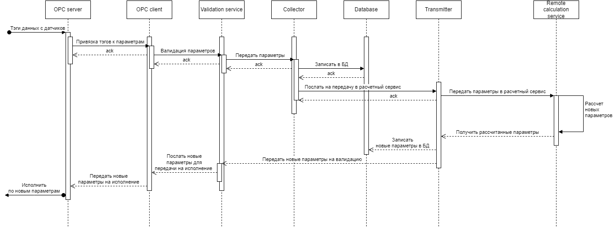
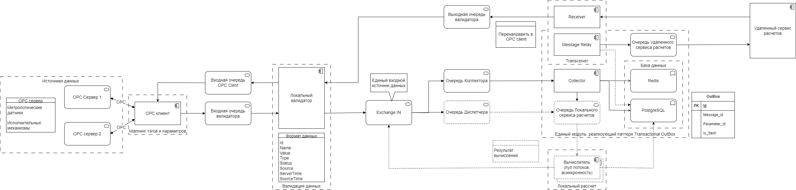

# WellDriver взаимодействие сервисов
Продолжаем развивать тему моей предметной области - автоматизация бурения нефтяных и газовых скважин.

В последнее время в сфере нефтесервиса наметилась тенденция к цифровой трансформации процесса бурения нефтяных и газовых скважин. 
Такие понятия как "цифровой двойник буровой установки" или "интеллектуальное бурение" уже вошди в обиход как недропользователей, так и буровых компаний и сервисных подрядчиков. 
Основная цель - повысить эффективность строительства нефтегазовых скважин, обеспечить полную безопасность работ и, в конечном счете, полностью автоматизировать процесс бурения.  
Процесс строительства скважин имеет сложную структуру взаимодействия множества сервисных подрядчиков каждый из которых выполняет собственную функцию.
например, один собирает данные с различных датчиков, другой производит инженерные расчеты и т.п. 
В связи с этим была поставлена цель разработать инструмент, который бы собирал всю необходимую информацию с буровых установок, проводил дополнительную обработку полученных данных, 
которые затем отправлялись бы для инженерных расчетов другому подрядчику. Потом эти новые данные должны быть переданы на исполнение непосредственно бурильщику для 
обеспечения автоматизации процесса бурения.
Данные парамерров бурения собираются непосредственно в процессе углубления скважины при бурении одной трубы по глубине. 
Удаленным подрядчиком в реальном времени (~10 сек) производится расчет параметров бурения по текущей глубине. 
Эти новые расчетные параметры передаются бурильщику на исполнительные механизмы в виде уставок для бурения следующей трубы.  

## Бизнес-цель

Разработать систему автоматизации процесса строительства нефтегазовых скважин для повышения эффективности бурения и обеспечения безопасности работ.

## Бизнес-драйверы

* Наша страна заинтересована в интенсификации нефтегазовой отрасли, как основного драйвера развития экономики. 
* Недропользователи заинтересованы в объективном контроле за работой буровых компаний и сервисных подрядчиков. 
* Буровые компании и сервисные подрядчики заинтеесованы в автоматизации процесса для снижения затрат и времени бурения, повышении качества и безопасности.
* Работники заинтересованы в атоматизации для улучшения условий труда, повышении зарплаты и безопасности.

## Требования

* Система WellDriver устанавливается на локальных объектах и имеет собственное хранилище. 
* Система собирает данные от всех источников.
* Система осуществляет предварительную обработку и валидацию данных.
* Система передает данные в реальном времени удаленному подрядчику для проведения инженерных расчетов.
* Удаленный подрядчик производит расчет новых праметров бурения по текущей глубине и передает новые параметры обратно.
* Система производит валидацию полученнх данных, запись новых параметров в базу данных и затем передает рассчитанные параметры на исполнительные механизмы бурильщику в виде уставок. 
* Система также производит визуализацию информации для мониторинга процесса бурения. 

## Дополнительный контекст

* Небходимость транзакционной записи данных в БД и передачи на рассчет.
* Планируется расширение видов источников данных и сигналов.
* Планируется добавление задач по дополнительной обработке данных и валидации.
* Удаленный расчетный сервис работает по REST API.
* Удаленный подрядчик инженерного сервиса гарантирует время рассчета < 10 сек.
* Основным идентификатором сообщений является глубина бурения.

## Пользовательские истории

* Система автоматически получает данные с нескольких источников информации на буровой площадке в виде параметров датчиков.
* Система проводит в реальном времени предварительную обработку и валидацию полученной информации.
* Система записывает полученные данные с датчиков в локальную БД.
* Система передает данные в удаленный сервис для расчетов.
* Система вычисляет значения параметров, которые должны быть выведены из анализа полученной в реальном времени информации. 
* Система получает новую информацию из удаленного расчетного центра.
* Система проводит валидацию новых данных,записывает их в локальную БД и передает на исполнительные механизмы для продолжения бурения.

## Атрибуты качества или свойства архитектурв

* Доступность - Сервис системы должен быть доступен с любое время (99,9 - исходя из специфики работы).
* Производительность - Время обработки < 10 секунд (реальное время).
* Надежность - Не должно быть потери информации на любом этапе передачи.
* Безопасность - Полученная и обработанная информация должна храниться в локальной базе в безопасности.
* Расширяемость - Должна быть возможность подключения других алгоритмов расчета, любых новых источников данных и т.п.
* Масштабируемость - Должна быть предусмотрена возможность значительного увеличения источников данных и параметров (x100).
* Модифицируемость - возможность добавления новых функций и безшовного изменения старых.

## Критические сценарии и критические характеристики

* доступность сервисов системы , здесь подразумевается не только доступность через пользовательский интерфейс, но и доступность в смысле получения информации по всем данным;
* надежность: процент потерянной информации - ориентироваться на 0.009%
* время прохождения данных от датчиков до сервиса расчетов - 95% квантиль времени ответа сервисов для клиента не должно превышать 1с;
* время прохождения данных от сервиса расчетов до исполнительных механизмов - 95% квантиль времени ответа сервисов для клиента не должно превышать 10с;
* раширяемость – должна быть предусмотрена возможность подключения новых функций и возможностей;
* время разработки (time to market)
* стоимость разработки (budget/cost)

## Диаграмма последовательности (sequence diagram):

В процессе предварительного архитектурного анализа было выделено несколько сервисов для системы WellDriver:
* OPC Server - прием данных с датчиков по протоколу OPC.
* OPC Client - предварительная обработка тэгов OPC сервера и привязка к параметрам бурения.
* Validation service - первоначальная обработка и валидация полученных параметров.
* Collector - запись данных в локальную БД и передача для посылки в удаленный расчетный сервис. Здесь должна быть обеспечена транзакционная запись и передача в удаленный сервис
* Database - локальная база данных.
* Transceiver - передача данных в расчетный сервис и прием рассчитанных параметров от него.
* Remote calculation service - удаленный сервис инженерных расчетов.

## Взаимодействие сервисов:
Рассмотрим взаимодействие сервисов по синхронной и асинхронной семантике и возможности преобразования сервисов в микросервисы.
С учетом того, что удаленный сервис инженерных расчетов работатет по протоколу REST API общая семантика будет синхронной и общее время обработки будет включать время рассчета, 
которое мы не можем контролировать полностью.
Также нужно иметь в виду, что необходимо обеспечить транзакционную модель при записи в базу данных с одновременной отправкой параметров в удаленный сервис.

 
* Сервис OPC Server (или несколько серверов) может быть удаленным, а может быть реализован в составе системы WellDriver: получает данные со всех датчиков и отаправляет их в OPC Client, 
также принимает данные от OPC Clientа и направляет их на исполнительные механизмы. Обмен данными осуществляется по протоколу OPC в виде тэгов парамнтров данных.
* Сервис OPC Client может быть реализован в виде микросервиса. Сервис делает маппинг тэгов OPC сервера и параметров бурения. Отправляет принятые данные в виде сообщений во входную очередь локального валидатора. Здесь реализована асинхронная модель обмена сообщениями по pub/sub.
* Сервис Локальный валидатор принимает сообщения из очереди по подписке, производит валидацию параметров данных бурения (проверка на тип, статус, источник данных) и отправляет параметры дальше в брокер сообщений для передачи сервис реализующий транакционную модель (запись в БД и передача в удаленный сервис расчетов). Сервис валидатор также может выполнен в виде микросервиса. Здесь реализована асинхронная модель обмена сообщениями по pub/sub.
* Сервис реализущий транзакционную модель реализован по паттерну Transactional OutBox, где Коллектор осуществляет транзакционную (по БД) запись информации в БД и в таблицу Outbox, а Message Relay транзакционно (по БД) считывает информацию из таблицы Outbox и отправляет данные в очередь удаленного сервиса расчетов. Здесь же реализована функция приема сообщений из удаленного сервиса расчетов и отправка полученных данных в выходную очередь валидатора по pub/sub. выполняет несколько функций:
	* запись информации в БД (PostgreSQL - для транзакций и Redis - кэш данных)
	* отправку информации в очередь удаленного сервиса расчетов.
	* возможна реализация собственного локального сервиса расчетов.Так как здесь мы полностью контролируем код, то нет необходимости пропускать данные через валидатор.
* Сервис OPC Client принимает данные по подписке из Входная очереди ОРС Cient и по протоколу OPC отправляет их далее на исполнительные механизмы в виде уставок. 
* При создании сообщения ему присваиваются атрибуты:
	* Id - идентификатор сообщения (в таблице Outbox Message_Id)
	* Name - имя параметрам
	* Value - значение параметра
	* Type - тип параметра
	* Status - статус сообщения
	* Source - источник данных
	* SourceTime - время сообщения, которое контролируется при реализации realtime передачи данных. 

## Оценка атрибутов качества по заданным критериям

* Доступность - здесь подразумевается то, что сервис должен быть в работе (доступен) в любое время  с вероятностью 99,9% (исходя из специфики работы). Это гарантирутся выбранными архитектурными решениями по бесперебойной и надежной передаче данных. 
* Производительность - время обработки в нормальных условиях (при наличии связи) < 10 секунд (реальное время). Здесь подразумевается, что мы контролируем прямое и обратное направления передачи от сервиса удаленных рассчетов и принятые решения по использованию в межсервисных коммуникациях асинхронной модели по подписке с помощью высокопроизводительного брокера сообщений RabbitMQ оправдано и укладывается в заданные параметры производительности.
* Надежность - использование в межсервисных коммуникациях надежного брокера сообщений RabbitMQ с возможностью подтверждения передачи гарантирует надежную передачу данных без потерь. Также использование паттерна Transactional OutBox гарантирует сохранение и передачу данных с соблюдением консистентности данных в конечном счете.
* Безопасность - здесь подразумевается технологическая безопасность бурения, которая подразумевает четкое выполнение бурения по рассчетным параметрам в исполнительных механизмах, а это гпрпнтируется  организацией архитектурв системы WellDriver. Актуальность realtime данных контролируется по трем атрибутам - идентификатору сообщения, времени создания сообщения и глубине.
* Расширяемость - приведена реализация допоплнительного локального сервиса расчета, что подтверждает возможность расширения сервисов. Также использование асинхронной семантики по подписке с помощью брокера сообщений позволяет просто подкючить новый сервис добавлением очереди. 
* Масштабируемость - при значительном увеличении источников данных и параметров возможно вертикальное и горизонтальное масштабирование всех компонентов stateless системы.
* Модифицируемость - новые функции добавляются путем введения новых сервисов. Модификация старых сервисов производится путем локального изменения кода.  Все межсервисные взаимодействия зафиксированы в контрактах при изменении которых производится коррекция только смежных сервисов. 
	

