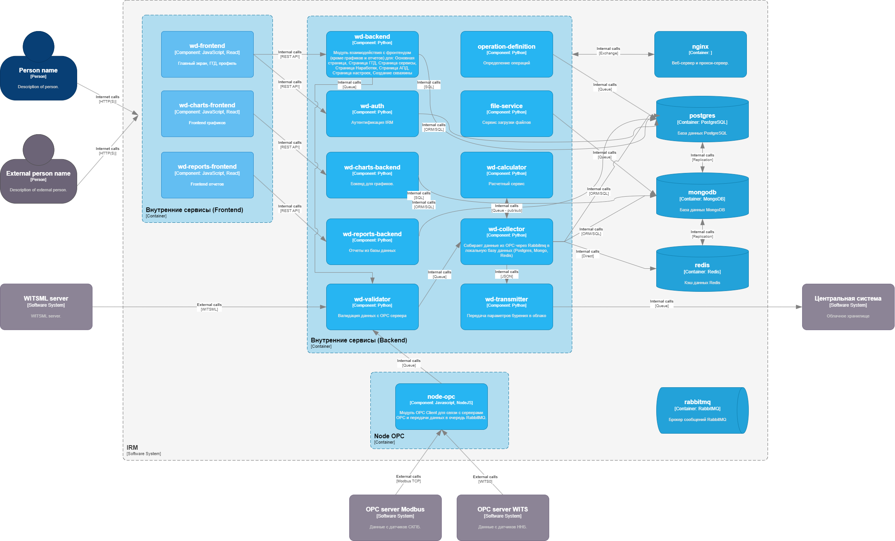

# WellDriver - Системное проектирование
Продолжение темы - автоматизация бурения нефтяных и газовых скважин с помощью системы WellDriver.
  

## Бизнес-цель

Для автоматизации развертывания системы WellDriver на компьютере локального объекта необходимо обеспечить контейнеризацию компонентов и представить диаграмму развертывания.

## Бизнес-драйверы

* Необходимость разделения компонентов приложения WellDriver на контейнеры для удобства программирования, тестирования и развертывания.
* Необходимость обеспечения автоматического развертывания компонентов приложения WellDriver.
 

## Требования

* Система WellDriver устанавливается на компьютерах локальных объектов. 
* Компоненты системы помещены в контейнеры. Версионирование ведется по контейнерам.
* Есть необходимость в дальнейшем разделить некоторые компоненты по бизнес-доменам.
* Необходимо обеспечить возможность разделения некоторых компонентов на микросервисы, каждый в своем контейнере.
* Необходимо обеспечить автоматичекское развертывания контейнеров на объектах.
* Необходимость использования подхода CQRS по принципам обработки. 

## Дополнительный контекст

* Сейчас реализована сервисно-ориентированная архитектура с единой БД.
* Разделение компонентов на контейнеры осуществляется по системному принципу.
* Взаимодействие компонентов frontend-backend происходит по REST API.
* Взаимодействие компонентов внутри backend происходит асинхронно через брокер сообщений.
* Доступ компонентов к БД осуществляется напрямую через ORM.

## Атрибуты качества или свойства архитектурв

* Доступность - Сервис системы должен быть доступен с любое время (99,9 - исходя из специфики работы).
* Производительность - Время обработки < 10 секунд (реальное время).
* Надежность - Не должно быть потери информации на любом этапе передачи и обработки.
* Развертываемость - Должно быть реализовано автоматическое развертывание компонентов по независимым контейнерам.
* Модифицируемость системы - Возможность разделения компонентов по контейнерам с дальнейшей реализацией архитектуры микросервисов.

## Критические сценарии и критические характеристики

* доступность сервисов системы , здесь подразумевается не только доступность через пользовательский интерфейс, но и доступность в смысле получения информации по всем данным;
* надежность: процент потерянной информации - ориентироваться на 0.009%
* развертывемость - автоматическое развертывание системы по контейнерам;
* модифицируемость - разделение компонентов по контейнерам с реализацией микросервисной архитектуры.
* время разработки (time to market)
* стоимость разработки (budget/cost)

## Диаграмма контейнеров

В процессе предварительного архитектурного анализа было выделено несколько контейнеров для системы WellDriver:
* Внутренние сервисы Frontend - контейнер, содержащий компоненты frontend:
	* wd-frontend - основной компонент frontend
	* wd-charts-frontend - компонент frontend, реализующий построение графиков
	* wd-reports-frontend - компонент frontend, реализующий вывод отчетов
* Внутренние сервисы Backend - контейнер, содержащий компоненты backend:
	* wd-backend - основной сервис backend
	* wd-aurh - сервис аутентификации и авторизации
	* wd-charts-backend - backend для реализации графиков
	* wd-reports-backend - backend для реализации отчетов
	* wd-validator - сервис валидации
	* operation-definition - сервис определения операций
	* file-service - файловый сервис
	* wd-calculator - расчетный сервис
	* wd-collector - сервис записи в БД
	* wd-transmitter - сервис передачи данных в облако
* Node OPC - контейнер микросервиса node-opc для получения данных от различных автоматических источников по разным протоколам
* Контейнеры поддерживающих сервисов:
	* nginx - web-сервер и прокси сервер
	* postgres - сервер базы данных PostgreSQL
	* mongodb - сервер базы данных Mongo DB
	* redis - кэш данных
	* rabbitmq - брокер сообщений RabbitMQ
* Взаимодействие компонентов контейнеров frontend-backend происходит по REST API.
* Взаимодействие компонентов node-opc, wd-validator, wd-collector wd-calculator, wd-transmitter происходит через очереди брокера сообщений асинхпронно.
* Доступ к БД PostgreSQL осуществляется по ORM/SQL
* Доступ к БД Mongo DB осуществляется по ORM записью данных параметров бурения.
* Сервис redis используется для кэширования наиболее часто данных
* Удаленные сервисы сбора данных подключаются к сервису node-opc по различным протоколам через opc интерфейс.
* Внешние поставщики данных бурения подключаются по специальному протоколу WITSML.
* Пользователи подключаются к web-серверу и взаимодействуют с компонетами frontend по протоколу HTTP(S).

## Декомпозиция слоя данных

* Все поступающие данные классифицируются по источникам и различаются по способам хранения в базах данных:
	* Данные параметров бурения (временные ряды) передаются через сервис node-opc, проходят через первичный валидатор wd-validator и затем поступают в компонент wd-collector, который записывает информацию в БД Mongo DB (mongodb) и далее в кэш redis.
	* Данные внешних сервисов и информация, вносимая через web-интерфейс (информация, относящаяся к бизнес-домену - скважины, оборудование, буровая установк и т.п.) проходит через валидатор и также поступает в компонент wd-collector, который записывает ее в БД PostgreSQL. 
* Временные ряды используются для анализа и воспроизведения графиков.
* Для вычисления, определения оперций и т.п. используются данные из всех БД, в зависимости от вида.
* Предполагается использовать паттерн CQRS для разделения записи (mongodb) и чтения (postgres), также необходимо модифицировать сервис wd-collector.
* Для ускорения доступа к данным временных рядов используется компонент redis, который получает информацию из mongodb
* Для обеспечения надежной передачи данных в облако реализован паттерн Transactional OutBox, где компонент  wd-collector осуществляет транзакционную (по БД) запись информации в БД PostgreSQL и в таблицу Outbox, а wd-transmitter транзакционно (по БД) считывает информацию из таблицы Outbox и отправляет данные в очередь для передачи в облако. 

## Диаграмма развертывания

 
* Диаграмма развертывания, по сути, повторяет вид контейнерной диаграммы и показывет размещение контейнеров приложения на сервере WellDriver
* Здесь же показаны компоненты приложения внутри контейнеров и способы взаимодействия.

## Оценка атрибутов качества по заданным критериям

* Доступность - здесь подразумевается то, что сервис должен быть в работе (доступен) в любое время  с вероятностью 99,9% (исходя из специфики работы). Это гарантирутся выбранными архитектурными решениями по бесперебойной и надежной передаче данных через брокер сообщений. 
* Производительность - время обработки в нормальных условиях (при наличии связи) < 10 секунд (реальное время). Здесь используются принятые решения по асинхронной модели передачи данных по подписке с помощью высокопроизводительного брокера сообщений RabbitMQ и хранения оперативных данных в кэше. Использование паттерна CQRS и разделение данных по виду источника позволяет гибко управлять потоками данных, что также повышает производительность.
* Надежность - использование в межсервисных коммуникациях надежного брокера сообщений RabbitMQ с возможностью подтверждения передачи гарантирует надежную передачу данных без потерь. Использование паттерна Transactional OutBox гарантирует сохранение и передачу данных с соблюдением консистентности данных в конечном счете.
* Развертываемость  - обеспечивается разграничением компонентов по контейнерам и реализацией раздельной загрузки контейнеров с помощью CI/CD.
* Модифицируемость системы - возможно дальнейшее разделение компонентов по контейнерам и дальнейшая реализация их в качестве микросервисов.
	
## Возможные риски

* Дальнейшее разделение компонентов по контейнерам может привести к избыточному потреблению памяти.
* Необходимость настройки CI/CD для автоматического версионирования и развертывания.
* Рефакторинг сервиса wd_collector.
